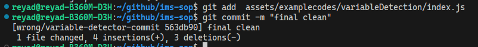

# Clean Commit Guidelines

Day to day tasks for developers is to develop features, make changes in the codebase and once they are happy, push their codes to target branches for testing by going through a review process. 

Imagine you are reviewing someone elses code and not understanding anything what they did in a pull request. You will soon lose productivity.

Clean commits are required to review changes quickly and keep a linear commit histoy in the timeline. It helps to be better organised.

This guideline will be a story like approach to better explain the situatioins.

## Story

Let's say you have been given a requirement to build an email client/UI where you will have a text editor that will have a simple feature called `variable-detection`. Let me explain what I mean. Imagine the following contents in your email text editor.

```sh
Hi {{ customerName }},

We are exited to share a new promo code with you as part of your {{ numberOfYears }} years aniversary with us. Your promo code is: {{ promoCode }}.

Best regards,
Marketing Team 
```
After this type of templates are edited they are now saved in a database and later using this template a backend email compiler sends the email to the relevant customers.

> Important: Our point of intereset is to develop the variable detection algorithm. No focus or interest is needed to develop the email compiler for the sake of this guideline. 

This is what we will be building:


## Development

Given the above requirements a `@jr-developer` will sit for work and start developing the feature and this may take around few hours (or days) to develop it. A `@sr-reviewer` will be responsible to check on what the `@jr-developer` has developed. 

In practice, the `@jr-developer` will open a **PR** (Pull Request) for his codes to be reviewed and merged by the `@sr-reviewer`. For the sake of simplicity and better understanding of the development process, [PR#1](https://github.com/ims-systems-00/sop/pull/1) and [PR#2](https://github.com/ims-systems-00/sop/pull/2) has been created which will be handy later. 

Notice [PR#1](https://github.com/ims-systems-00/sop/pull/1) is marked as the wrong way and [PR#2](https://github.com/ims-systems-00/sop/pull/2) is marked as the right way of doing things. This information is enough for now to get going. Later we will dive further.

> Important: Please check the [PR#1](https://github.com/ims-systems-00/sop/pull/1) before moving to the next section.

## Oops...

Everything went over the head? Not to worry, let's break it down and simplify.

## Situation Explainer

Let's look at how the `@jr-developer` progressed over the week. Put yourself in his position.

### Day-1 (Alternatively call coding-session-1)

At the starting point `@jr-developer` creates two files `index.html` and `index.js` and he progresses with the codes. For the first day, he was able to finish until the following codes before 5 p.m. 

**./index.html**
```html
<!DOCTYPE html>
<html lang="en">
  <head>
    <meta charset="UTF-8" />
    <meta name="viewport" content="width=device-width, initial-scale=1.0" />
    <title>Document</title>
  </head>
  <style>
    #text-editor {
      width: 400px;
      height: 400px;
    }
  </style>
  <body>
    <textarea name="" id="text-editor"></textarea>
  </body>
  <script src="index.js"></script>
</html>
```
**./index.js**
```js
const texteditor = document.getElementById("text-editor")

texteditor.addEventListener('input', function(e) {
    console.log(e.target.value)
})
```

At this point only the basic text editor boilerplate files are created and the initial commit looks like following.

```sh
git commit -m "initial commit"
```

> Going forward, we will avoide other git commands for brevity.


### Day-2 (Alternatively call coding-session-2)

The `@jr-developer` starts from where he left and makes more changes. He adds some logical changes in the `index.js` file. The current code looks like this:

`./index.js`

```js
const texteditor = document.getElementById("text-editor")

function detectVaraibles(e){
    const variableDetector = /{{  }}/g
    const value = e.target.value
    const matches = value.match(variableDetector)
    return matches
}
texteditor.addEventListener('input',function(e){
    console.log(e.target.value)
    let variables = detectVaraibles(e)
    console.log(variables)
})
```
Here he developed the algorithm in the `detectVaraibles` function and used the function inside the `input` event listener + added some `console.log`(s) in the file. No rocket science so far. At this point, the `@jr-developer` knows he is not finished yet with his implementation, so he just commits with whatever message pops into his mind.

```sh
git commit -m "wip"
```
> wip stands for **work in progress** in case you are not familiar with the term.


> Note: In the `detectVaraibles` function, currently `e` is taken as the parameter and then it is somehow used inside the function. Please keep this information in mind.

### Day-3 (Alternatively call coding-session-3)

Now the `@jr-developer` finds that the current `RegEx` logic is wrong and he fixes the `RegEx` value `/{{  }}/g` (it's wrong because this does not detect any text inside {{ }} braces) by replacing it with `/{{ \w+ }}/g` (notice **variableDetector** has been renamed to **variableDetectorRegx**). He also improves some type safety logics in the code. The improved version of the code looks like the following

`./index.js`
```js
const texteditor = document.getElementById("text-editor");

function detectVaraibles(e) {
  const variableDetectorRegx = /{{ \w+ }}/g;
  const value = e.target.value;
  const matches = value.match(variableDetectorRegx);
  if (Array.isArray(matches)) {
    return matches
      .map((match) => {
        console.log(match,typeof match === "string", match.slice(3, match.length - 3))
        if (typeof match === "string") return match.slice(3, match.length - 3);
        return null;
      })
      .filter((match) => match);
  }
  return matches;
}
texteditor.addEventListener("input", function (e) {
  console.log(e.target.value);
  let variables = detectVaraibles(e);
  console.log(variables);
});

```

The `@jr-developer` takes a cup of cofee with the peace in mind that he has developed a ground breaking solution for his team and commits it. He then goes for a nice walk with his dog.

```sh
git commit -m "invalid logic fix"
```


### Day-4 (Alternatively call coding-session-4)

The next day he cleans some unnecessary `console.log`(s) and commits again. The current code is as follows

```js
const texteditor = document.getElementById("text-editor");

function detectVaraibles(e) {
  const variableDetectorRegx = /{{ \w+ }}/g;
  const value = e.target.value;
  const matches = value.match(variableDetectorRegx);
  if (Array.isArray(matches)) {
    return matches
      .map((match) => {
        if (typeof match === "string") return match.slice(3, match.length - 3);
        return null;
      })
      .filter((match) => match);
  }
  return matches;
}
texteditor.addEventListener("input", function (e) {
  let variables = detectVaraibles(e);
});
```

```sh
git commit -m "code clean up"
```


### Day-5 (Alternatively call coding-session-5)

So far so good. Suddenly, he remebers an improvement and makes some changes in the `detectVaraibles` function implementation. He changes the function parameter from `e` to `text` in order to totally decouple the function from html `input` event, thus making the implementaion rebust.

> Ask me in DM why it is better to replace `e` with `text` if you need an explainer. Hint: `textarea` vs `rich-texteditor`.
 
Now the text contents are passed from outside the `detectVaraibles` function which is in the event listener callback. 

```js
// injecting the text content
.
.
.
let variables = detectVaraibles(e.target.value);
.
.
.
```

Remember the `e` in the parameter of `detectVaraibles` this has now totally been changed. The final version of the code now looks like the following

**./index.js**

```js
const texteditor = document.getElementById("text-editor");

function detectVaraibles(text) {
  const variableDetectorRegx = /{{ \w+ }}/g;
  const value = text;
  const matches = value.match(variableDetectorRegx);
  if (Array.isArray(matches)) {
    return matches
      .map((match) => {
        if (typeof match === "string") return match.slice(3, match.length - 3);
        return null;
      })
      .filter((match) => match);
  }
  return matches;
}
texteditor.addEventListener("input", function (e) {
  let variables = detectVaraibles(e.target.value);
  console.log("detection: ", variables);
});
```

The `@jr-developer` again has to make a commit. He puts whatever pops into his mind as the commit message.

```sh
git commit -m "final clean"
```



> TODO: Checkout the commit chain again in this [PR#1](https://github.com/ims-systems-00/sop/pull/1), relate with the explainer and see if you better understand the story so far.

## Take a Breath

While you are enjoying some fresh air, let's send this [PR#1](https://github.com/ims-systems-00/sop/pull/1) to our Mr `@sr-reviewer` to review. Take some breake if you need to.

## Back to Business

So far we have been looking at the situation from a `@jr-developer`s perspective. If you have looked at [PR#1](https://github.com/ims-systems-00/sop/pull/1) carefully, from the first glance it doesn't look too bad or uncomfortable to review for the `@sr-reviewer`. Because atleaset the commit messages still looks relevant to the works. But from the `@sr-reviewer` point of view let's look at some observations in the next sections.

> Important: Remember this is just a very simple feature, not a bigger picture.

## Observations

Now put yourself in `@sr-reviewer`s position.

- Notice that the `index.js` file has changed multiple times in the commit chain.
- Notice that the state of `index.js` file in commit [wip](https://github.com/ims-systems-00/sop/pull/1/commits/aa44ddf7723d1f6c0fb81a24efafc3a109f7fca2) and [code clean up](https://github.com/ims-systems-00/sop/pull/1/commits/e55535f3c39cba7364ed72e7dbe6eb2558f7385b). Don't we think that the [code clean up](https://github.com/ims-systems-00/sop/pull/1/commits/e55535f3c39cba7364ed72e7dbe6eb2558f7385b) commit looks much more complete than the commit [wip](https://github.com/ims-systems-00/sop/pull/1/commits/aa44ddf7723d1f6c0fb81a24efafc3a109f7fca2), becuase most of the logics are implemented there?
- Notice the first few commits totally became obsolet because of the constant implementation changes in the `detectVaraibles` function. In the final commit changing the parameter value from `e` to `text` totally makes the previous commits unnecessary to read for the `@sr-reviewer`.
- Imagine how painful would it be for the `@sr-reviewer` if the `@jr-developer`s history had a 20 commits and in every commit he is having to check the same `index.js` file for the logics. Wouldn't it be better if the `@sr-reviewer` had the final implementation of the feature at once. And no work is constantly repeated in the commit chain. 
- Finally imagine this pain is for only one file change. When developing practical features...? you know what I'm talking about. 

If `@jr-developer` followed this process, chances are in real usecase his commit chain might become a gigantic 30 commits long tail making it a complete nightmare for any `@sr-reviewer` that is reviewing.

## What's the solution?

So how do the team avoid these situations? Not to worry, I've got your back. See the steps below:

1. Well, at first the `@jr-developer` has to be really careful about the commits that he is making.
2. He should only commit after he is confident with what he has done.
3. The `@jr-developer` should cautiously put commit messages so the `@sr-reviewer` understands.
4. He should only commit the stable codes.
5. He should show his codes bit by bit every day to the the `@sr-reviewer`.

> O hello mate!! Hang on !!!! Don't trust everything you read. All of these steps are bullshits. Don't you think these are some real pains in the posterior for the `@jr-developer` + the `@sr-reviewer`.

Saying that, it's still **usefull** to put some proper commit messages. But it would be **amazing**, if the `@sr-reviewer` could see the following final implementation in the very first few commits and no repeat of the file in other commits.

**./index.js**
```js
const texteditor = document.getElementById("text-editor");

function detectVaraibles(text) {
  const variableDetectorRegx = /{{ \w+ }}/g;
  const value = text;
  const matches = value.match(variableDetectorRegx);
  if (Array.isArray(matches)) {
    return matches
      .map((match) => {
        if (typeof match === "string") return match.slice(3, match.length - 3);
        return null;
      })
      .filter((match) => match);
  }
  return matches;
}
texteditor.addEventListener("input", function (e) {
  let variables = detectVaraibles(e.target.value);
  console.log("detection: ", variables);
});
```

It would be great if you had the commits like this 


> Check the [PR#2](https://github.com/ims-systems-00/sop/pull/2). It's the best time to look at it.

See, as a `@sr-reviewer` he is only interested to know about the final implementation, becuase he has the responsibility to protect the quality. Plus he doesn't need to know every single thing you did or faced over the development process. It makes his job much easier.

But given the 5 steps(I could add more jargons) above, the `@jr-developer` certainly cannot achive this kind of cleanliness. Moreover, as a `@jr-developer` he also has the right to develop feartures in free mind and commit codes how he wants. Let me explain what I mean:

The `@jr-developer` still needs to commit how he was commiting before. This gives him ultimate freedom. 

1. `initial commit` - (good commit message)
2. `wip` - (can be made better)
3. `invalid logic fix` - (really good commit message for your own reference)
4. `code clean up` - (again, yet another good commit)
5. `final clean` - (unclear, still works somehow)
6. `iccha moto dilam commit` - (mercy here plese)
7. `ja mathay ashlo dilam` - (mercy here plese)
8. `apato mon chaice tai dilam` - (mercy here plese)
9. `bou er sathe jhogra hoise` - (please don't hurt yourself, we need you in the team)

> Please have some rahmah(mercy) on your commit messages. And yeah, unlike the begining of this section, I'll not play around with your attention anymore. We are getting serious now.

As the `@jr-developer` keeps developing he also keeps pushing the codes to his remote branch on a daily basis. (In case his machine burns up in the storm he still has backup in github) 

So how do we achive this state [PR#2](https://github.com/ims-systems-00/sop/pull/2) from this state [PR#1](https://github.com/ims-systems-00/sop/pull/1). Believe me there is no rocket science. I have good news for you. With some simple git commands this can be achieved.

> Before I show the solutions I would like to now talk about a few things. In the web + youtube you may get a lot of articles or instructions of different git commands like `git revert`, `git rebase` and `git reset`. You may understand them thoroughly. In that case we're **genuinely** happy to have you in the team. No questions asked hats off, you may already understand the solution and be thinking what bullshit is this article. But this is for someone who stuggles to understand the usecases of these commands, also for someone new for the team to understand our development philosophy. And I purposefully did not include **TL;DR** so that eveyone reads this fully. I really appriciate your patience, because that is what every developer needs.

## Organise Your Commits

Alright, let's get back to business. To transform this chain [PR#1](https://github.com/ims-systems-00/sop/pull/1) into this chain [PR#2](https://github.com/ims-systems-00/sop/pull/2) please follow the strategies bellow. You can trust me now, these are `strategies` not the `steps` lol.

### Strategy-1 (Soft reset)

> Prerequisites: The `@jr-developer` should follow a 3 way merge strategy on a daily basis in the `feature` branch to keep the `feature` branch up to date with `main`/`master` or whatever the target branch is. What this means is on a daily basis `@jr-developer` has to run `git pull origin master` in his `feature` branch to merge latest changes from others.

To implement the strategy, at first the `@jr-developer` checkout to his `feature` branch where he has commited according to his needs.

```sh
git checkout feature_branch_name
```

The `@jr-developer` runs a git log command:

```sh
git log
```
This will show up the commit history. Here comes the trick, `@jr-developer` will soft reset his changes to the `parent` node where the branch started. In his case it is the commit called `contribution guidelines added` (see the image).


The `@jr-developer` copies the commit hash and runs the soft reset command to reset his current changes back to the specified commit.

```sh
git reset --soft ce3ed2041e01bba3ae0b7bba2c21478f1f16805f
```
At this point the `@jr-developer` runs a `git log` command and sees that all the commits that he made are gone now.


Let's hold for a minute here. Follwing is the project state image. If you look at the changes you will see it is the final state of all the codes that the `@jr-developer` did over the week. The codes are staged but not commited.     


To verifiy this he runs

```sh
git status
```


> Caution: Don't use `git reset --hard ...` without knowing what you are doing.

The `@jr-developer` needs to unstage the files now to create a clean commit history. In order to unstage the files he can use `git restore --staged <file>...` command. 

Another way is to use `reset` command without any flag. Simply running the following command will unstage all the changes:

```sh
git reset
```

To verify the unstaging he can again run a `git status` command.

```sh
git status
```

Now let's see how the `@jr-developer` has to organise the commits. He will pick the relevant files one by one and keep them together with a proper detailed message. Organising the relevant files here is an art which develops with experience.

Here are the organised commits the `@jr-developer` makes:

```sh
git add ./assets/examplecodes/variableDetection/index.html
git commit -m "add: created the html markup for UI"
```
```sh
git add assets/examplecodes/variableDetection/index.js
git commit -m "add: varaible detection logic"
```
He runs a git log now:
```sh
git log
```


The `@jr-developer` now have to push the changes to remote. He will need to use `--force` flag because remote changes and his local changes are now different, github needs to understand which one to keep in the history. `--force` falg will override the remote history.
```sh
git push origin feature_branch_name --force
```

> Hurrah!!! The history now looks like [PR#2](https://github.com/ims-systems-00/sop/pull/2). 

### What's next

How are your codes get merged into the trunks. Leave it with the `code-owner` for now. Dependning on the work loads and situations, we may need to follow the `rebase` strategy or 3 way `merge` strategy to incorporate codes in the relevant branches. Consult with other team members about these later. If you are curious to know about `rebase` vs `merge` there are tons of materials online.

> Happy Coding.